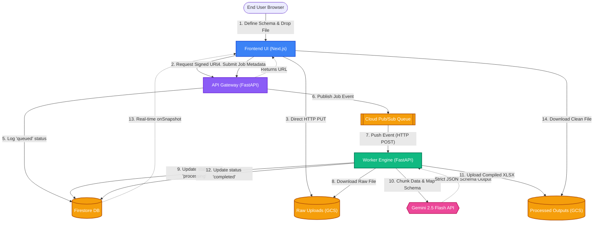
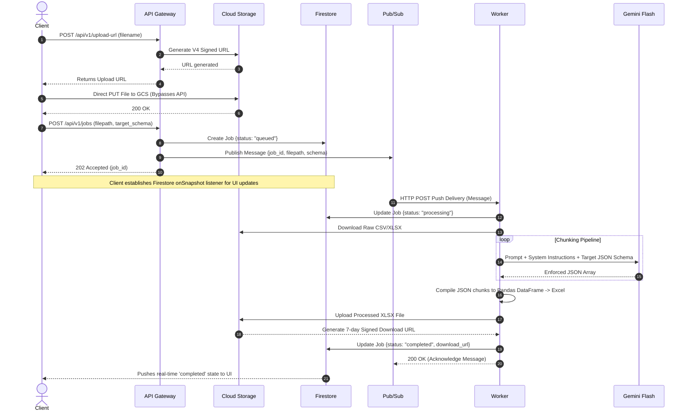

# Structurify: Architectural Deep Dive

This document provides a comprehensive overview of the **Serverless Fan-Out Architecture** that powers Structurify. The system is designed to handle computationally heavy ETl (Extract, Transform, Load) tasks without blocking the web servers, guaranteeing high availability and extremely low latency for the end user.

---

## 1. High-Level System Architecture

Structurify is composed of three main layers, all orchestrated via Google Cloud Platform (GCP) serverless primitives:

1. **Client/Presentation Layer:** Next.js React Application
2. **Gateway/Routing Layer:** FastAPI Backend (Cloud Run)
3. **Execution/Worker Layer:** FastAPI Async Worker (Cloud Run) + Gemini 2.5 Flash

### Component Flowchart

---

## 2. Event-Driven Execution Flow (Sequence Diagram)

The true power of Structurify lies in its decoupled nature. The Backend API never touches the actual file payload, and the Frontend never waits on a blocking HTTP request for the LLM to finish processing. 

---

## 3. Core Architectural Decisions

### 1. Direct-to-Cloud-Storage Uploads
**Problem:** Uploading a 50MB spreadsheet through a standard API endpoint causes massive memory bloat on the server and risks HTTP timeout limits.
**Solution:** The Backend API acts purely as an authenticator. It generates a short-lived presigned URL, allowing the client's browser to stream the file directly to a GCS bucket, bypassing the web server entirely.

### 2. Serverless Fan-Out via Pub/Sub Push
**Problem:** LLM compilation can take anywhere from 10 seconds to 5 minutes depending on file size. A standard HTTP request will time out after 30-60 seconds, leaving the user with a 504 Gateway Timeout.
**Solution:** The API Gateway immediately responds with a `202 Accepted` and drops the job onto an event bus (`Cloud Pub/Sub`). Pub/Sub then reliably pushes this event to the asynchronous Worker engine. If the worker fails, Pub/Sub will automatically retry the event using exponential backoff.

### 3. Strict Schema Enforcement via Gemini Structured Output
**Problem:** Large Language Models naturally hallucinate or return improperly formatted JSON strings, breaking data pipelines.
**Solution:** The worker utilizes Gemini 2.5 Flash's `response_schema` configuration. The user-defined schema (e.g. `{"id": "Integer", "name": "String"}`) is dynamically translated into an OpenAPI 3.0 standard schema structure and passed directly to the model's generation config, forcing the model to guarantee absolute schema adherence.

### 4. Firestore Real-time Synchronization
**Problem:** With asynchronous processing, the client has no way of knowing when the task finishes unless it implements aggressive, resource-heavy HTTP polling (e.g. `setInterval(() => fetchStatus(), 1000)`).
**Solution:** By storing the job state in Google Firestore, the Next.js client establishes an active WebSocket-based `onSnapshot` listener. The second the Worker updates the database to "completed", the Firebase SDK pushes the state change to the UI instantaneously with zero overhead.
