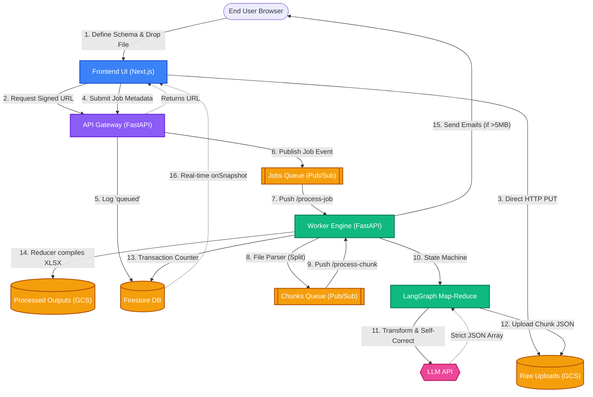
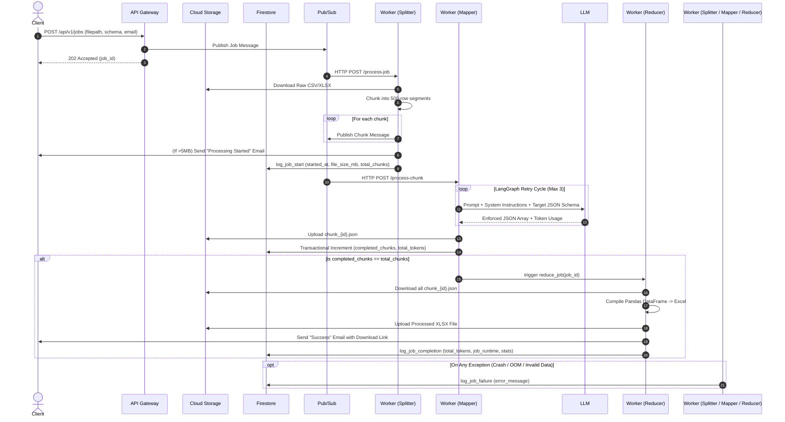

# Structurify: Architectural Deep Dive

This document provides a comprehensive overview of the **Serverless Fan-Out Architecture** that powers Structurify. The system is designed to handle computationally heavy ETL (Extract, Transform, Load) tasks without blocking the web servers, guaranteeing high availability and extremely low latency for the end user.

---

## 1. High-Level System Architecture

Structurify is composed of three main layers, all orchestrated via Google Cloud Platform (GCP) serverless primitives:

1. **Client/Presentation Layer:** Next.js React Application
2. **Gateway/Routing Layer:** FastAPI Backend (Cloud Run)
3. **Execution/Worker Layer:** FastAPI Async Worker (Cloud Run) + LangGraph + LLM

### Component Flowchart

---

## 2. Map-Reduce Event-Driven Execution Flow (Sequence Diagram)

The true power of Structurify lies in its decoupled, multi-staged Fan-Out architecture. 

---

## 3. Core Architectural Decisions

### 1. Direct-to-Cloud-Storage Uploads
**Problem:** Uploading a 50MB spreadsheet through a standard API endpoint causes massive memory bloat on the server and risks HTTP timeout limits.
**Solution:** The Backend API acts purely as an authenticator. It generates a short-lived presigned URL, allowing the client's browser to stream the file directly to a GCS bucket, bypassing the web server entirely.

### 2. LangGraph Map-Reduce Pipeline
**Problem:** A 100,000-row spreadsheet cannot be processed by a single LLM API call due to token context limits (8k output tokens) and aggressive Cloud Run HTTP timeout constraints.
**Solution:** The Worker employs a highly concurrent Split-Map-Reduce design. 
- **Split:** The file is chunked into 500-row segments.
- **Map:** Each chunk is mapped over LLM concurrently via Pub/Sub. If a chunk fails extraction, a LangGraph state machine catches the error and loops back for up to 3 self-correction retries.
- **Reduce:** A Firestore transactional counter tracks chunk completions and eventually merges them into a unified `.xlsx` file.

### 3. Strict Schema Enforcement, Auto-Clean, & Preview Mode
**Problem:** LLMs are prone to hallucinating formats or omitting columns. Running a full pipeline on an invalid schema is costly.
**Solution:** 
- **Sandbox Preview Mode:** The system can be triggered in a preview mode where the split phase instantly cuts the input to exactly 10 rows. This allows rapid validation of the extraction quality without wasting excessive compute tokens on dead runs.
- **Schema Mapping:** If a target schema is provided, LLM is forced to map the data directly to a JSON Schema object (`response_schema`).
- **Auto-Clean Mode:** If no target schema is provided, Structurify dynamically infers the schema, cleans up the mess (capitalization, whitespaces, date formats), and returns the entire spreadsheet as a valid JSON array.

### 4. Asynchronous Email Notifications
**Problem:** Large files can take several minutes to process. Users might close the browser tab.
**Solution:** If a file is larger than 1 MB, the Worker instantly sends an HTML email containing a tracking link (`/track?jobId=...`) the moment the file begins chunking. A secondary success email delivers the final download link, guaranteeing the user never loses their data.

### 5. Rate Limits & Cloud Run Concurrency
**Problem:** LLM Free Tier limits allow a maximum of 15 Requests Per Minute (RPM) and 1,500 Requests Per Day. A 50-chunk file processed completely in parallel by Cloud Run will instantly trigger a `429 RESOURCE_EXHAUSTED` error.
**Solution:** Tenacity is used inside the `LLMEngine` to automatically perform exponential backoffs (up to 60s) on `429` errors. For production, upgrading the GCP project to a paid tier removes this limit, allowing Cloud Run to process 1,000+ chunks concurrently.

### 6. Observability, Telemetry & Billing
**Problem:** A highly concurrent, decoupled architecture is incredibly difficult to monitor. We need to prevent "ghost jobs" (silent failures) and strictly track exact compute/token usage for billing and rate-limiting.
**Solution:** The `AuditService` logs a rich telemetry object to a separate `job_audits` Firestore collection:
- **Identity:** Captures `user_id` (via Auth) and decoupled `ip_address` (for guest rate-limiting without polluting user accounts).
- **Execution Cost:** The LangGraph state machine extracts `total_token_count` from LLM API responses. The API router safely tracks token expenditure across parallel Cloud Run instances using `firestore.Increment()` in a guaranteed atomic transaction.
- **Performance Profiling:** Logs exactly when a job starts `started_at` to distinguish between "queue wait time" and true `job_runtime_seconds`. Also logs `file_size_mb` and `total_chunks` (parallelization factor).
- **Hard Failure Handling:** Every microservice wraps work in `try/except` and forcefully pushes a `log_job_failure` to the audit log on crash, guaranteeing no job gets stuck in `processing`.

### 7. Cost Mitigation & Graceful Cancellation
**Problem:** If a user submits a massive file by mistake, they need a way to cancel the job mid-flight. Merely purging the Pub/Sub queue orphans the database records ("ghost jobs"). Furthermore, checking Firestore for a cancellation signal before processing every chunk would generate massive read volumes, eating into database quotas.
**Solution:** Structurify employs a Graceful Cancellation API coupled with an **In-Memory TTL Cache**.
- When the UI triggers a cancellation, the Firestore document is instantly marked as `cancelled`, and a notification is published to Pub/Sub to instantly dispatch a 'Job Cancelled' email to the user.
- **Secure API Authentication**: The backend cancellation endpoint strictly verifies Firebase JWT tokens. If a job belongs to a registered user, the token's `uid` must match the job's `user_id`. If the job was created by an unauthenticated guest, the API allows cancellation based on possession of the mathematically unguessable UUIDv4 `job_id`.
- The backend also features an **Emergency Kill Switch** that purges the entire Pub/Sub backlog by seeking the cursors to the current timestamp, gracefully halting thousands of chunks instantaneously while firing off email notifications to the affected users.
- Before hitting the LLM API (which costs tokens), each worker checks if the job is cancelled.
- To prevent excessive Firestore reads, the worker caches the status check in its local memory for 15 seconds. If a burst of 50 chunks arrives simultaneously, the worker queries Firestore exactly *once* and relies on the memory cache for the remaining chunks, cutting read costs by over 95%.

## 4. Firestore Data Model & Collections

Structurify uses a NoSQL document database (Firestore) to track real-time state, telemetry, and settings. Below are the core collections and their roles:

1. **`users`**
   - **Purpose:** Stores user profiles, authentication metadata, subscription tiers (`plan`), Enterprise SSO context (`tenant_id`, `workspaces`), and Stripe-ready billing attributes (`subscription_status`, `payment_date`).
   - **Usage:** Queried by the Next.js frontend to enforce role-based access control, workspace isolation, and usage limits.

2. **`jobs`**
   - **Purpose:** Tracks the real-time lifecycle of a data transformation job.
   - **Usage:** Contains fields like `status` (`queued`, `processing`, `completed`), `processed_rows`, and `download_url`. The frontend subscribes to this collection via `onSnapshot` to render the live loading timeline.

3. **`job_audits`**
   - **Purpose:** Stores rich telemetry, token usage, and performance profiling for every job.
   - **Usage:** Written to by the Cloud Run Worker. Tracks exactly how many LLM tokens were used for billing, how long the job took in seconds, and captures any hard crash logs. Read by the Admin Portal's Live System Feed.

4. **`deployments`**
   - **Purpose:** An append-only audit trail of system deployments.
   - **Usage:** Whenever `deploy.sh` or GitHub Actions triggers a rollout, a new document is POSTed here containing the commit hash, actor, and a direct link to the Cloud Build / Firebase logs. Read by the Admin Portal's Deployment History table.

5. **`settings`**
   - **Purpose:** Global platform configuration, runtime settings, and dynamic AI Prompt Management.
   - **Usage:** Contains dynamic configurations like the `system` document (which controls the active `llm_model`, chunk sizes, and editable system instructions / user prompts for the AI extraction engines). The Admin Portal writes to this collection via the Settings tab using a "Save Changes" bulk-commit strategy. Backend workers globally cache these settings (via `DynamicConfigService`) and instantly adapt their behavior without requiring code redeployments.
